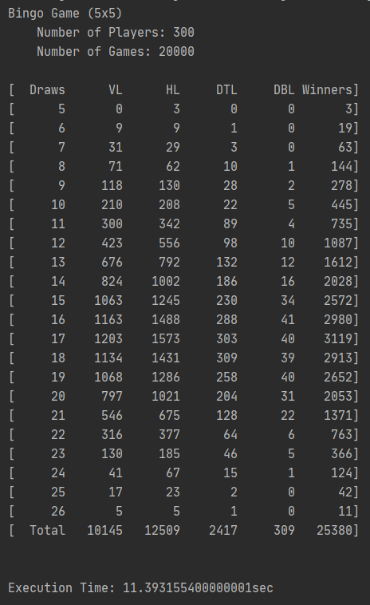

# Bingo Game Simulator
An application simulating a Bingo game and calculating winning rate of each bingo combination type in each turn. The objective of this project was to check that the winning rate of diagonal bingo combination types is significantly lower than the rest types, which expected and discussed from the research paper, "The Topics in Combinational Analysis: Backward Induction, Graph Theory, and Egyptian Fractions." 
# Features

- Generate bingo boards filling with random numbers. 
- Simulate given number of games with given number of players.
- Check wins in a vertical, horizontal, or two distinct diagonal rows at which turn the winner(s) appeared. 
- Record how many players win in each type and in each turn. 
- Record the execution time.

